# WeatherReporter - Complete Weather Application

A modern, responsive weather application built with Next.js 15, featuring real-time weather data, location search, forecasting, and interactive data visualization.

🔗 Experience Weather Reporter: https://weather-reporter-ten.vercel.app

## 🌟 Overview

WeatherReporter is a full-stack weather application that provides comprehensive weather information including current conditions, 24-hour forecasts, and 5-day predictions with interactive charts. The application features intelligent caching, location-based search, and a responsive design optimized for all devices.

## 🏗️ System Architecture

### High-Level Architecture


### Technology Stack  

| Technology | Version | Purpose |
|------------|---------|---------|
| **Next.js** | 15.3.3 | Full-stack React framework with App Router |
| **React** | 19.0.0 | UI library with modern hooks |
| **TypeScript** | 5.x | Type-safe development |
| **Redux Toolkit** | 2.8.2 | Predictable state management |
| **Tailwind CSS** | 4.x | Utility-first styling |
| **ECharts** | 5.6.0 | Interactive data visualization |
| **Axios** | 1.10.0 | HTTP client for API requests |
| **Google Maps Services** | 3.4.1 | Location autocomplete |

## 🚀 Features

### 1. Smart Location Search
- **Autocomplete**: Real-time city suggestions using Google Places API
- **Caching**: localStorage-based prediction caching for performance
- **Debouncing**: 500ms delay to prevent excessive API calls  

### 2. Current Weather Display
- Real-time weather conditions
- Temperature with "feels like" indicator
- Humidity, wind speed, and UV index
- Weather condition icons and descriptions
- Manual refresh capability

### 3. 24-Hour Forecast
- Hourly weather predictions
- Temperature trends
- Weather condition icons
- Horizontal scrollable interface
- Time formatting (12-hour with AM/PM)

### 4. 5-Day Forecast
- Daily min/max temperatures
- Weather condition summaries
- Interactive temperature trend charts
- Wind speed visualization

### 5. Interactive Charts
- Dual-axis temperature and wind speed charts
- Responsive design for mobile and desktop
- ECharts-powered visualizations
- Real-time data updates

## 🔄 Data Flow Architecture

### Complete User Journey

```mermaid
sequenceDiagram
    participant User as "👤 User"
    participant SearchBar as "🔍 SearchBar"
    participant LocationCache as "💾 Location Cache"
    participant PlacesAPI as "🌍 Google Places API"
    participant Redux as "🏪 Redux Store"
    participant WeatherCache as "⚡ Weather Cache"
    participant WeatherAPI as "🌤️ Weather API"
    participant UI as "🖥️ UI Components"
    
    User->>SearchBar: Type city name
    SearchBar->>LocationCache: Check cache
    
    alt Cache Hit
        LocationCache-->>SearchBar: Return predictions
    else Cache Miss
        SearchBar->>PlacesAPI: Fetch predictions
        PlacesAPI-->>SearchBar: Location suggestions
        SearchBar->>LocationCache: Store in cache
    end
    
    User->>SearchBar: Select city
    SearchBar->>Redux: dispatch(fetchCurrentWeather)
    SearchBar->>Redux: dispatch(fetchWeather)
    
    Redux->>WeatherCache: Check weather cache
    
    alt Weather Cache Hit
        WeatherCache-->>Redux: Return cached data
    else Weather Cache Miss
        Redux->>WeatherAPI: Fetch weather data
        WeatherAPI-->>Redux: Weather response
        Redux->>WeatherCache: Store in cache
    end
    
    Redux-->>UI: Update components
    UI-->>User: Display weather data
```



## 🏛️ State Management

### Redux Store Structure 

```mermaid
graph TB
    subgraph "Redux Store"
        RootState["🏪 RootState"]
        
        subgraph "Weather Slice"
            WeatherData["data: WeatherForecastResponse"]
            WeatherLoading["loading: boolean"]
            WeatherError["error: string | null"]
        end
        
        subgraph "Current Weather Slice"
            CurrentData["data: WeatherResponse"]
            CurrentLoading["loading: boolean"]
            CurrentError["error: string | null"]
            ResetSearch["resetSearch: boolean"]
        end
    end
    
    subgraph "Async Actions"
        FetchWeather["fetchWeather"]
        FetchCurrent["fetchCurrentWeather"]
    end
    
    subgraph "Cache Layer"
        WeatherCache["weatherCache"]
        ForecastCache["forecastCache"]
    end
    
    RootState --> WeatherData
    RootState --> CurrentData
    FetchWeather --> WeatherCache
    FetchCurrent --> ForecastCache
```



### Caching Strategy  

The application implements a sophisticated multi-layer caching system:

**Weather Data Cache:**
- **TTL**: 10 minutes (600,000ms)
- **Capacity**: 100 cities maximum
- **Strategy**: LRU eviction when capacity exceeded
- **Storage**: In-memory JavaScript objects

**Location Predictions Cache:**
- **TTL**: 10 minutes
- **Storage**: Browser localStorage
- **Key Format**: `placePredictionCache_{query}`

## 🌐 API Integration

### External APIs

#### 1. Weather API Service 

- **Provider**: WeatherAPI.com (inferred from URL structure)
- **Current Weather**: Real-time conditions
- **Forecast**: 5-day weather predictions
- **Authentication**: API key via environment variable

#### 2. Google Places API 

- **Service**: Google Maps Places Autocomplete
- **Purpose**: Location search suggestions
- **Client**: Official Google Maps Services library

### API Routes Architecture


## 🛠️ Component Architecture

### Component Hierarchy 

```mermaid
graph TD
    App["🏠 App"] --> Layout["📱 Layout"]
    Layout --> MainPage["🌤️ MainPage"]
    
    MainPage --> SearchBar["🔍 SearchBar"]
    MainPage --> DetailCard["📊 DetailCard"]
    MainPage --> HourForecast["⏰ HourForecastCard"]
    MainPage --> DayForecast["📅 DayForecastCard"]
    
    DayForecast --> WeatherChart["📈 WeatherChart"]
    
    subgraph "Shared Components"
        DetailLoader["⏳ DetailLoader"]
        Loader["🔄 Loader"]
        CustomIcon["🎨 CustomIcon"]
    end
    
    DetailCard --> DetailLoader
    DetailCard --> CustomIcon
    HourForecast --> DetailLoader
    DayForecast --> Loader
```



### Key Components

#### SearchBar Component
- **Debounced input**: 500ms delay for API efficiency
- **Autocomplete**: Real-time location suggestions
- **Cache integration**: localStorage for predictions
- **Error handling**: Graceful fallbacks for API failures

#### DetailCard Component
- **Current weather**: Temperature, humidity, wind, UV index
- **Refresh functionality**: Manual data refresh
- **Responsive design**: Mobile-first approach
- **Loading states**: Skeleton loaders during data fetch

#### WeatherChart Component
- **Dual-axis charts**: Temperature and wind speed
- **Responsive**: Adapts to screen size
- **Interactive tooltips**: Detailed data on hover
- **ECharts integration**: Professional data visualization

## 🔧 Configuration & Setup

### Environment Variables

```bash
# Weather API Configuration

WEATHER_API_KEY=your_weather_api_key_here
NEXT_WEATHER_SERVICE_API_URL=https://api.weatherapi.com/v1

# Google Places API Configuration
PLACES_API_KEY=your_google_places_api_key_here

### Installation & Development

# Clone the repository
git clone https://github.com/NigeeHettige/WeatherReporter.git
cd weather_reporter

# Install dependencies
npm install

# Set up environment variables
cp .env.example .env.local
# Add your API keys to .env.local

# Run development server
npm run dev

# Build for production
npm run build

# Start production server
npm start
```

### Next.js Configuration  

## 🚀 Performance Optimizations

### Caching Strategy
- **Multi-layer caching**: Weather data and location predictions
- **TTL management**: 10-minute expiration for optimal freshness
- **LRU eviction**: Efficient memory management

### Network Optimizations
- **Debounced search**: Reduces API calls by 80%
- **Parallel fetching**: Current and forecast data fetched simultaneously
- **Error resilience**: Graceful degradation on API failures

### UI Performance
- **Memoization**: Chart dependencies optimized with useMemo
- **Lazy loading**: Components loaded on demand
- **Responsive images**: Optimized weather icons

## 🔒 Error Handling

### Comprehensive Error Management 

| HTTP Status | Error Message | User Impact |
|-------------|---------------|-------------|
| 400 | Invalid city name | Input validation feedback |
| 401 | Authentication failed | API key configuration issue |
| 404 | Weather data not found | Location not available |
| 429 | Too many requests | Rate limiting protection |
| 500 | Service unavailable | External service outage |

### Error Recovery Strategies
- **Cache fallback**: Use cached data when API fails
- **Retry logic**: Automatic retry for transient failures
- **User feedback**: Toast notifications for error states
- **Graceful degradation**: Partial functionality when services are down

## 📱 Responsive Design

### Mobile-First Approach
- **Breakpoints**: Tailwind CSS responsive utilities
- **Touch-friendly**: Optimized for mobile interactions
- **Performance**: Lightweight bundle for mobile networks

## 📊 Monitoring & Analytics

### Performance Metrics
- **Core Web Vitals**: LCP, FID, CLS optimization
- **Bundle analysis**: Webpack bundle analyzer integration
- **API response times**: Weather and location service monitoring

### Error Tracking
- **Client-side errors**: React error boundaries
- **API errors**: Structured error logging
- **User experience**: Error rate monitoring


## 📄 License

This project is licensed under the MIT License - see the LICENSE file for details.

## 🙏 Acknowledgments

- **WeatherAPI.com**: Weather data provider
- **Google Places API**: Location services
- **Vercel**: Hosting and deployment platform
- **Next.js Team**: Framework development
- **Open Source Community**: Dependencies and tools

---

**Built with ❤️ using Next.js, React, and TypeScript**

